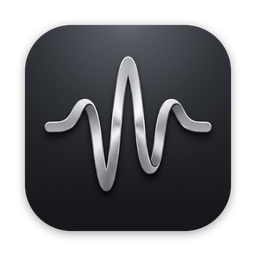
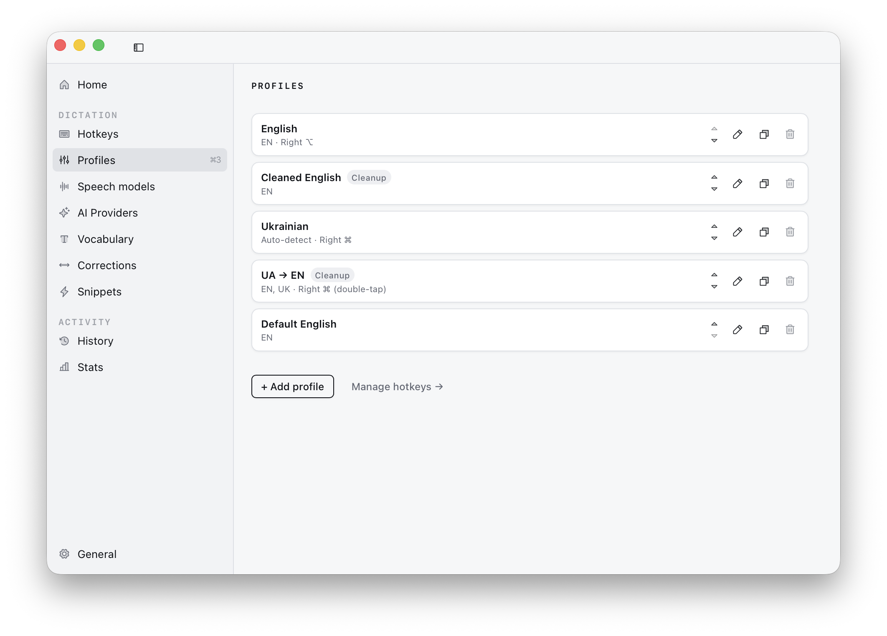
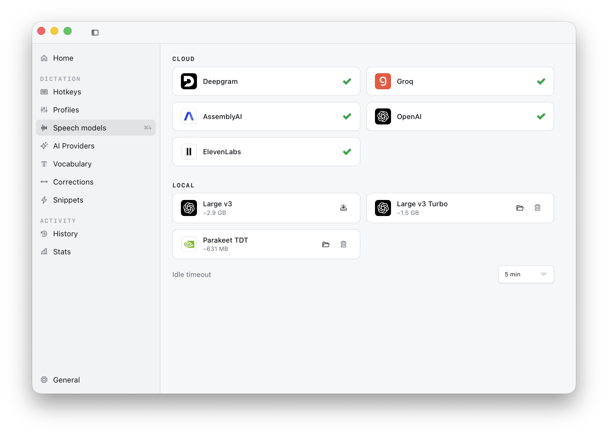
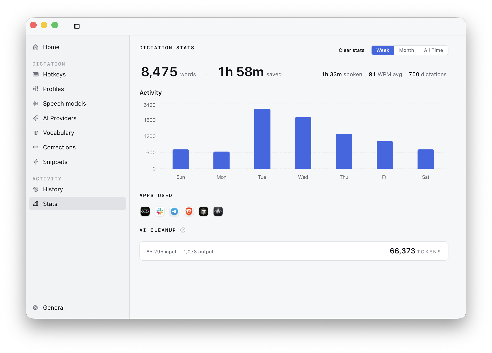

<div align="center">



# Whispr

**Hold a key. Speak. Your words appear — in any app.**

Push-to-talk dictation for your whole desktop. Whispr listens while you
hold a shortcut, transcribes what you said, optionally cleans it up with
an LLM, and types it straight into whatever app has focus.

[](https://github.com/maksymomelchuk/whispr/releases/latest)
&nbsp;

&nbsp;
[](#license)

<br />


</div>

<br />

## Why Whispr

Typing is slow; talking is fast. Whispr puts dictation one keypress away
in **every** application — your editor, your terminal, your browser, your
chat. Hold the shortcut, say what you mean, release, and the text lands at
your cursor.

- **Yours to control.** Choose your speech provider, your cleanup model,
  your hotkeys. Run entirely **on-device** if you never want audio to
  leave your machine.
- **Private by default.** Your transcript history lives only on your disk.
  API keys are stored locally and never leave the app.
- **Native and quiet.** A single small overlay while you speak, then it
  gets out of the way.

```
🎙  hold & speak  →  📝  transcribe  →  ✨  clean up (optional)  →  ⌨️  paste at cursor
```

## Features

- **Push-to-talk, everywhere.** Hold your shortcut to record, release to
  paste into the focused app. Double-tap and "paste latest" actions are
  configurable too.
- **Your choice of speech engine.** Stream in real time with
  [Deepgram](https://console.deepgram.com) (Nova) or
  [AssemblyAI](https://www.assemblyai.com), or batch-transcribe with
  [Groq](https://console.groq.com) (Whisper Large v3 / v3 Turbo),
  [OpenAI](https://platform.openai.com) (gpt-4o-transcribe), and
  [ElevenLabs](https://elevenlabs.io) (Scribe v2) — or go fully
  **on-device** with local Whisper (Large v3 / Turbo) and Parakeet TDT. No
  internet required for local models.
- **AI cleanup.** Optionally pass the raw transcript through an LLM to
  strip filler words, fix self-corrections, and apply casing and
  punctuation. Choose from Anthropic Claude (Opus / Sonnet / Haiku, with
  Claude Pro/Max sign-in), OpenAI GPT-5, Google Gemini, Groq and Cerebras
  (Llama, Qwen, GPT-OSS), DeepSeek, OpenRouter, or any OpenAI-compatible
  endpoint (Ollama, LM Studio, vLLM, …) via a Custom provider.
- **Profiles.** Save a full setup — speech engine, language, cleanup
  model, vocabulary, corrections, snippets — and switch between them for
  different apps or tasks.
- **Vocabulary.** Teach the recognizer your jargon, names, and acronyms so
  it gets them right the first time.
- **Corrections.** Find-and-replace rules applied after transcription —
  great for verbal punctuation or words a model keeps mishearing.
- **Snippets.** Spoken shorthands that expand into longer text, with
  placeholders like `{{DATE}}`, `{{TIME}}`, and `{{CLIPBOARD}}`.
- **History & stats.** Browse past transcriptions and see how much time
  you've spent dictating — all stored locally.

## Screenshots

<div align="center">



<br /><br />

<table>
<tr>
<td width="50%"></td>
<td width="50%"></td>
</tr>
</table>

</div>

## Install

Grab the latest build from
[**Releases**](https://github.com/maksymomelchuk/whispr/releases/latest):

| Platform    | What to download             | First-run note                                                                                                                                                                                    |
| ----------- | ---------------------------- | ------------------------------------------------------------------------------------------------------------------------------------------------------------------------------------------------- |
| **macOS**   | `.dmg`                       | The build is **unsigned**. Open the `.dmg`, drag Whispr to `/Applications`, then right-click the app → **Open** → confirm the "unidentified developer" prompt once. Later launches work normally. |
| **Windows** | `.msi` or `_en-US.setup.exe` | The build is unsigned. If SmartScreen warns, click **More info → Run anyway**.                                                                                                                    |
| **Linux**   | `.AppImage` or `.deb`        | `chmod +x Whispr_*.AppImage` and run it, or `sudo dpkg -i whispr_*.deb`.                                                                                                                          |

Once installed, Whispr keeps itself up to date — its built-in updater
fetches new versions automatically, no reinstall needed.

## Quick start

1. **Launch Whispr** and grant the one permission it needs to type for you:
   - **macOS** — _System Settings → Privacy & Security → Accessibility_,
     enable Whispr.
   - **Windows** — nothing extra.
   - **Linux** — install the keystroke tool for your session:
     `wtype` / `ydotool` / `dotool` on Wayland, or `xdotool` on X11.
2. **Pick how you want to transcribe.** For a cloud engine or AI cleanup,
   add your API key under **Speech models** / **AI Providers**. Prefer to
   stay offline? Download an on-device model from **Speech models → Local**.
3. **Hold your shortcut and talk.** Release, and your words appear at the
   cursor. Tune the rest — hotkeys, profiles, vocabulary — whenever you
   like.

## Privacy

Whispr is local-first. Your transcript **history** and **settings** never
leave your machine, and your **API keys** are stored on disk and are never
exposed back to the app's interface. When you use a cloud speech provider
or AI cleanup, only the audio or text for that request is sent to the
provider you chose — pick an on-device model to keep everything offline.

Settings and history live in your platform's app-data directory for
`com.whispr.app` (`~/Library/Application Support/…` on macOS,
`%APPDATA%\…` on Windows, `~/.local/share/…` on Linux).

## Contributing

Want to build from source, run the dev environment, or cut a release?
See [**CONTRIBUTING.md**](CONTRIBUTING.md).

## License

Released under the MIT License.
